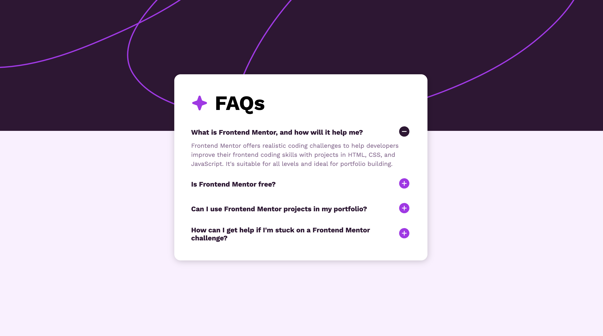
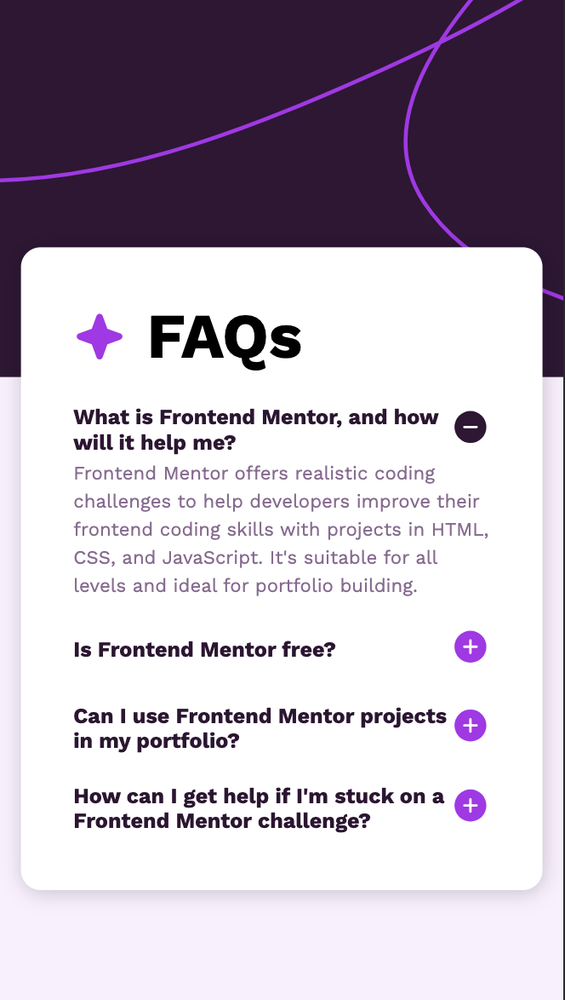

# Frontend Mentor - FAQ accordion solution

This is a solution to the [FAQ accordion challenge on Frontend Mentor](https://www.frontendmentor.io/challenges/faq-accordion-wyfFdeBwBz). Frontend Mentor challenges help you improve your coding skills by building realistic projects. 

## Table of contents

- [Overview](#overview)
  - [The challenge](#the-challenge)
  - [Screenshot](#screenshot)
  - [Links](#links)
- [My process](#my-process)
  - [Built with](#built-with)
  - [What I learned](#what-i-learned)

## Overview

### The challenge

Users should be able to:

- Hide/Show the answer to a question when the question is clicked
- Navigate the questions and hide/show answers using keyboard navigation alone
- View the optimal layout for the interface depending on their device's screen size
- See hover and focus states for all interactive elements on the page

### Screenshot

### Links

- Solution URL: [Add solution URL here](https://your-solution-url.com)
- Live Site URL: [Add live site URL here](https://your-live-site-url.com)

## My process

### Built with

- Semantic HTML5 markup
- CSS custom properties
- Flexbox
- Javascript

### What I learned

Through doing this project, I became more comfortable with CSS and Javascript. A problem I had with the faq-accordian project was changing the button image from the plus icon to the minus icon when active/inactive. My initial idea when trying to seperate the question and answers into sections, was to have a text element for the question and a div element for the button. I quickly realised when trying to make the button and the answer text active, this would make the code confusing and cluttered. I then found using ::after in the css would enamble me to add the images as content after the question in a much neater way. question part of the accordian section was clicked. To switch to the opposite image and show the answer text, in the JS file using the querySelectorAll to get a NodeList of the elements that matched these query selectors. the four different questions and and answers. Using an eventListener, if an question is clicked the active classes will be added to specific question based on the index of the element within the nodeList.
